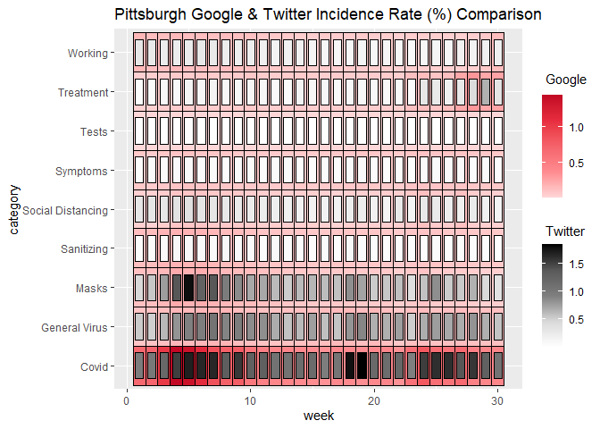
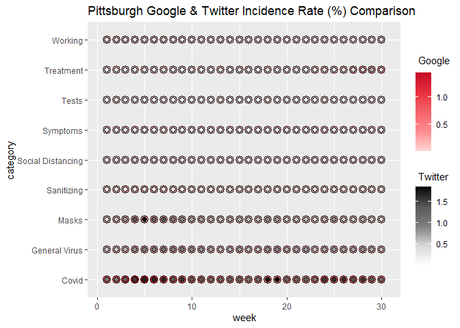

ggDoubleHeat
================

<!-- badges: start -->

[](https://github.com/PursuitOfDataScience/ggDoubleHeat/actions)
<!-- badges: end -->

The `ggDoubleHeat` package is a `ggplot2` extension that provides
visualization for data from two different sources on a modified heat
map. All functions from the package are named as `geom_heat_*()`. A
regular heat map, which can be made by using `geom_tile()` from
`ggplot2`, contains three dimensions (variables). `geom_heat_*()`,
however, can express four dimensions of data on a single plot.

## Installation

Please install the released version of `ggDoubleHeat` from CRAN with:

``` r
install.packages("ggDoubleHeat")
```

Alternatively, you can install the latest development version from
Github with:

``` r
# install.packages("devtools")
devtools::install_github("PursuitOfDataScience/ggDoubleHeat")
```

## Usage

For demonstration purposes, the built-in dataset `pitts_tg` is used to
illustrate the basic usage of the package.

``` r
library(ggDoubleHeat)
library(ggplot2)
pitts_tg
```

    ## # A tibble: 270 x 6
    ##    msa         week week_start category          Twitter  Google
    ##    <chr>      <int> <date>     <chr>               <dbl>   <dbl>
    ##  1 Pittsburgh     1 2020-06-01 Covid              0.965  0.681  
    ##  2 Pittsburgh     1 2020-06-01 General Virus      0.538  0.0982 
    ##  3 Pittsburgh     1 2020-06-01 Masks              0.466  0.117  
    ##  4 Pittsburgh     1 2020-06-01 Sanitizing         0.0561 0.127  
    ##  5 Pittsburgh     1 2020-06-01 Social Distancing  0.294  0.0386 
    ##  6 Pittsburgh     1 2020-06-01 Symptoms           0.0457 0.0770 
    ##  7 Pittsburgh     1 2020-06-01 Tests              0.0130 0.00415
    ##  8 Pittsburgh     1 2020-06-01 Treatment          0.0459 0.0376 
    ##  9 Pittsburgh     1 2020-06-01 Working            0.295  0.160  
    ## 10 Pittsburgh     2 2020-06-08 Covid              1.01   0.707  
    ## # ... with 260 more rows

`pitts_tg` is a dataset that collects the 30-week period of
COVID-related Google & Twitter incidence rate for 9 different categories
from the Pittsburgh Metropolitan Statistical Area (MSA). For the
complete information of the dataset, please type `?pitts_tg` on the
console.

Let’s start with `geom_heat_grid()`:

``` r
ggplot(data = pitts_tg, aes(x = week, y = category)) +
  geom_heat_grid(outside = Google, inside = Twitter) +
  ggtitle("Pittsburgh Google & Twitter Incidence Rate (%) Comparison")
```

<!-- -->

Now changing `geom_heat_grid()` to `geom_heat_circle()`:

``` r
ggplot(data = pitts_tg, aes(x = week, y = category)) +
  geom_heat_circle(outside = Google, inside = Twitter) +
  ggtitle("Pittsburgh Google & Twitter Incidence Rate (%) Comparison")
```

<!-- -->

Let’s use `geom_heat_tri()`:

``` r
ggplot(data = pitts_tg, aes(x = week, y = category)) +
  geom_heat_tri(lower = Google, upper = Twitter) +
  ggtitle("Pittsburgh Google & Twitter Incidence Rate (%) Comparison")
```

<!-- -->

To make things a bit more colorful, the most popular emoji for a given
week in a given category from the respective Pittsburgh Twitter daily
sample files is rendered on each component of the heatgrid by using
`ggtext`. The following code is commented, as it takes few minutes to
generate. If you would like to run it, just simply uncomment the code.
**But the generated heatgrid with emojis is attached below as an
image**.

``` r
# install.packages("ggtext")
# library(ggtext)
# 
# ggplot(data = pitts_tg, aes(x = week, y = category)) +
#   geom_heat_grid(outside = Google, inside = Twitter) +
#   # rendering emojis using "richtext"
#   annotate("richtext", x = rep(c(1:30), 9), y = rep(1:9, each = 30), 
#            label = pitts_emojis, label.color = NA, fill = NA, size = 0.3) +
#   ggtitle("Pittsburgh Google & Twitter Incidence Rate (%) Comparison")
```


Note: `pitts_emojis` is the emoji metadata built in `ggDoubleHeat`.
Another thing worth noting is that there are some grids not having
emoji, and the reason is that there is no emoji unicode in the Twitter
sample file.
